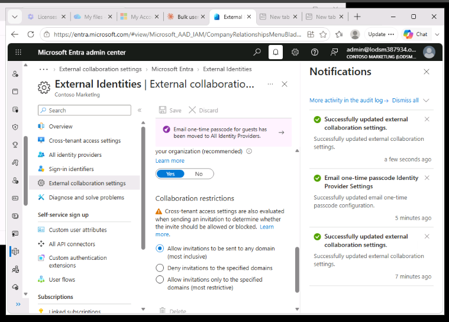
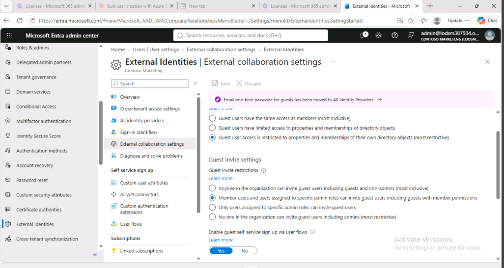

 Lab 4 – Configure External Collaboration Settings

This lab covered enabling external collaboration for the organization so approved guests can be invited and access resources appropriately.

 Exercise 1: Allowing guest users to be invited into your organization

Task 1 – Enable guest users to perform self-service sign-up
- In Entra ID > Users > All users > User Settings > Manage external user collaboration settings, set Enable guest self-service sign-up via user flows to Yes.
- Saved the change.

Task 2 – Configure external collaboration settings
- In Entra ID > External Identities > All identity providers,selected Email one-time passcode and set it to Configured: Yes.

- In External Identities > External Collaboration Settings, set:
  - Guest user access: "Guest user access is restricted to properties and memberships of their own directory objects (most restrictive)
  - Guest invite settings: "Member users and users assigned to specific admin roles can invite guest users including guests with member permissions"
  - Enable guest self-service sign-up via user flows: Yes
  - Collaboration restrictions: left at the default ("Allow invitations to be sent to any domain")
- Saved the changes.

 Key takeaways from this lab
- Guest access level controls what a guest can see and query in the directory once invited — the most restrictive option limits guests to only their own profile, with no visibility into other users, groups,
  or group memberships.
- Guest invite settings control who within the organization is allowed to send guest invitations — ranging from "anyone" to "no one,"independent of who can see what once invited.
- Email one-time passcode gives guests without an Azure AD or Microsoft account a secure way to verify their identity at sign-in.
- Collaboration restrictions (allow/deny lists) work independently of SharePoint and OneDrive sharing restrictions, which must be configured separately.
