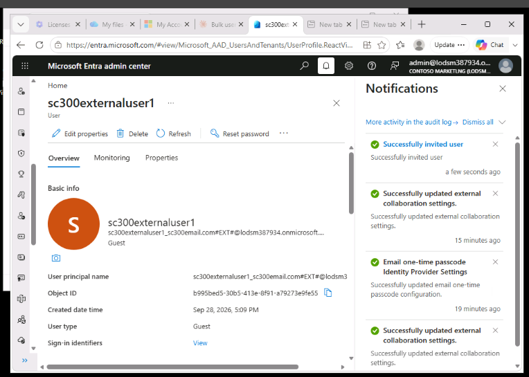
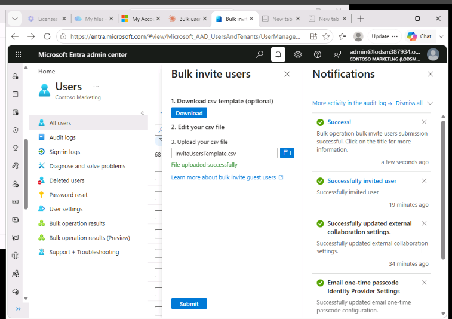
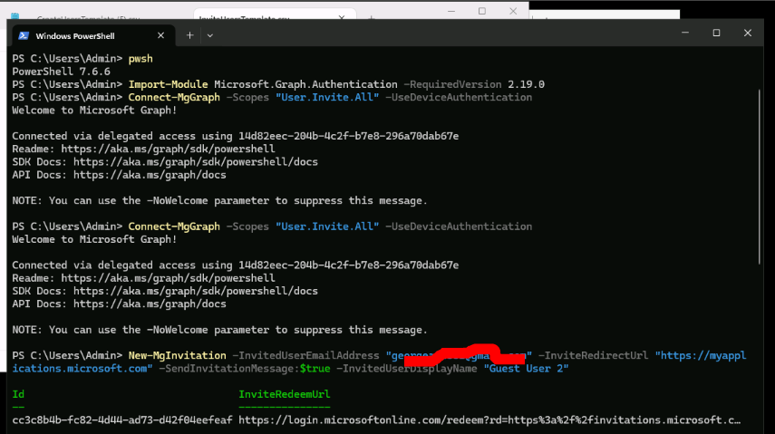

Lab 5 – Add Guest Users to the Directory

This lab covered onboarding external (guest) users into Microsoft EntraID — individually, in bulk via CSV, and via PowerShell.

Exercise 1: Add guest users to the directory

Task – Add the guest user
- In Entra ID > Users > All users > New user > Invite external user, invited a guest user with the email sc300externaluser1@sc300email.com.
- Verified on the Users page that the account's User type column showed Guest.
- Selected Review + Invite, then Invite, which automatically added the account to the directory as a guest.

Exercise 2: Invite guest users in bulk

Task 1 – Bulk user invite (CSV)
- Used Users > Bulk operations > Bulk invite, downloaded the sample CSV template, and added a line for each guest user with the required Email address to invite and Redirection URL values.
- Uploaded the completed CSV, which validated successfully ("File uploaded successfully").
- Selected Submit to start the bulk operation, and confirmed success via the notification and the Bulk operation results.

Task 2 – Invite guest users with PowerShell
- Confirmed PowerShell version 7.2+ was installed.
- Installed the Microsoft.Graph PowerShell module and confirmed with `Get-InstalledModule Microsoft.Graph`.
- Connected with `Connect-MgGraph -Scopes "User.ReadWrite.All"`.
- Used `New-MgInvitation` to invite a guest user directly from PowerShell, specifying the invited email address, redirect URL, and display name.
- Confirmed the invitation was created, shown by the returned `Id` and `InviteRedeemUrl`.

 Exercise summary

In this lab, guest users were invited individually through the Microsoft Entra admin center, in bulk by uploading a CSV file, and programmatically through Microsoft Graph PowerShell — showing how B2B
guest onboarding scales from a single invitation to many.

 Key takeaways from this lab
- Guest users can be invited through three different methods covered inthis lab: manually through the portal, in bulk via CSV, and programmatically via PowerShell/Microsoft Graph — useful depending on scale.
- Microsoft Entra ID does not support the "+" symbol in invited email addresses; it must be omitted to avoid delivery issues.
- `New-MgInvitation` requires the `User.Invite.All` or `User.ReadWrite.All` Graph scope and returns a redemption URL the guest uses to accept the invitation.
- Bulk invites follow the same CSV-formatting rules as bulk user creation — accuracy in the template matters for a successful upload.
